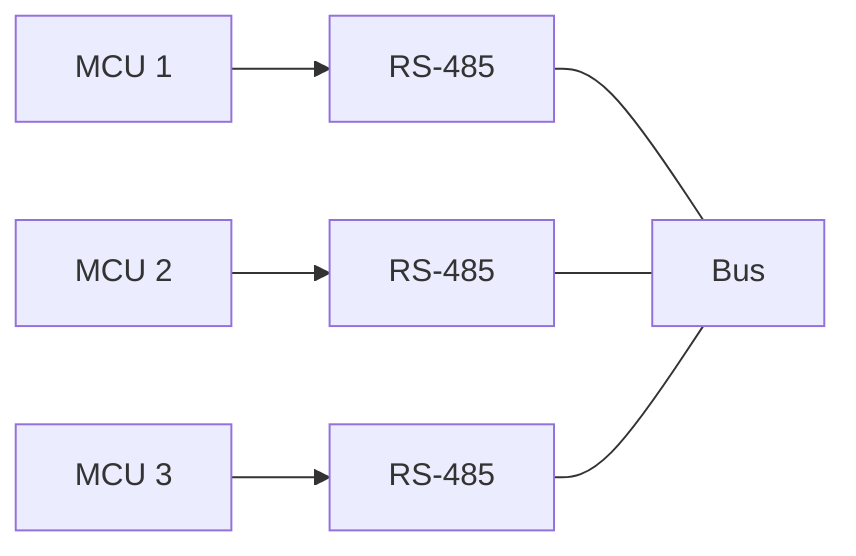
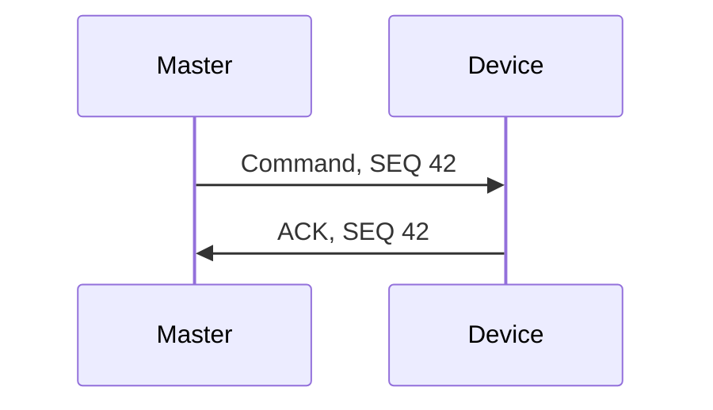
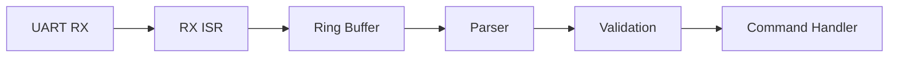
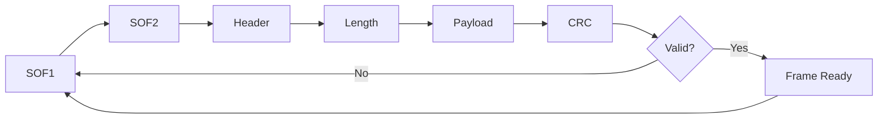

# Question 5 — UART Protocol and Parser

## Approach

UART is normally point-to-point. If the system can contain more than two boards, I would not connect several TX outputs together directly. A practical approach is to place the UART behind an **RS-485 transceiver** and use a simple master/response protocol so that only one node transmits at a time.

The communication problem is then split into three parts:

- **Physical layer:** UART + RS-485
- **Protocol:** addressing, framing, CRC, sequence number and acknowledgment
- **Firmware:** RX interrupt, ring buffer, parser and command validation



## Frame Format

I would use a small binary frame:

| Field | Size | Purpose |
|---|---:|---|
| SOF1 | 1 byte | Start marker `0xA5` |
| SOF2 | 1 byte | Start marker `0x5A` |
| Destination | 1 byte | Receiver address |
| Source | 1 byte | Sender address |
| Sequence | 1 byte | Message/retry identification |
| Command | 1 byte | Payload meaning |
| Length | 1 byte | Payload size |
| Payload | 0–64 bytes | Command data |
| CRC16 | 2 bytes | Frame integrity |

The CRC is calculated over the header fields after the SOF bytes and over the payload.

Two start bytes help the parser recover synchronization after malformed or missing data. The explicit length means the payload may contain any byte value without being confused with the frame delimiter.

## Integrity and Delivery

A valid CRC only proves that the received frame is internally consistent. It does not prove that the destination received and processed the message.

For commands that require delivery confirmation, I would use:



If the ACK does not arrive before a timeout, the sender retries the same sequence number. The receiver can then identify a retransmission instead of executing the same command twice.

For RS-485 transmission, the driver-enable signal should remain active until the UART reports that the last stop bit has actually left the peripheral, not only until the software TX buffer is empty.

## RX Interrupt Strategy

The receive interrupt should do as little work as possible.



The ISR only:

1. checks the UART error flags;
2. reads the received byte;
3. stores it in a circular buffer;
4. returns.

CRC calculation, parsing and command execution are done outside interrupt context.

This keeps interrupt latency short and avoids running application logic inside the UART ISR.

## Parser

The parser is implemented as a state machine because UART data arrives as a byte stream.



Frames with an invalid length or CRC are rejected. After an error, the parser returns to synchronization mode and searches for the next start sequence.

## Signed Payload Values

The protocol does not send native C structures directly.

Sending a structure as raw memory would make the protocol depend on padding, alignment, integer size and endianness.

For the example implementation, signed values use fixed-width types and an explicit byte order:

- `int16_t`
- little-endian payload encoding

For example, both positive and negative 16-bit values are serialized in the same defined two-byte format.

## Content Validation

CRC validation is only the first step.

A received frame should also be checked for:

- valid destination address;
- supported command;
- expected payload length for that command;
- valid parameter range;
- duplicate sequence number when retries are supported.

A frame can have a correct CRC and still contain an invalid command or an out-of-range value.

## Project Structure

```text
.
├── include
│   ├── protocol.h
│   └── uart_rx.h
├── src
│   ├── main.c
│   ├── protocol.c
│   └── uart_rx.c
├── Makefile
└── README.md
```

`uart_rx.c` contains the interrupt-side circular buffer.

`protocol.c` contains CRC16-CCITT, frame encoding, the parser state machine and fixed-width signed payload helpers.

`main.c` provides a Linux test that feeds bytes through the same RX ISR abstraction used by the parser.

## Build

```bash
make
```

The project is built with:

```text
-std=c11 -Wall -Wextra -Wpedantic -Werror
```

## Run

```bash
make run
```

Expected output:

```text
Valid frame test
Frame accepted
Source:      0x01
Destination: 0x02
Sequence:    42
Command:     0x10
Value:       -1234

Corrupted frame test
No frame accepted: CRC validation rejected the corrupted message
```

The first test encodes and receives a valid message containing a negative `int16_t` value. The second test modifies the CRC and confirms that the parser rejects the frame.

## Main Design Decisions

- UART is kept as the MCU serial peripheral, while RS-485 is used for a multidrop physical bus.
- The receive ISR does not parse frames or execute commands.
- A ring buffer decouples UART timing from application processing.
- The parser uses explicit framing and payload length.
- CRC16 checks transmission integrity.
- Sequence numbers allow ACK/retry handling without blindly repeating commands.
- Fixed-width types and explicit endianness make signed payload data portable.
- Command-specific checks validate the content after the frame passes CRC validation.
